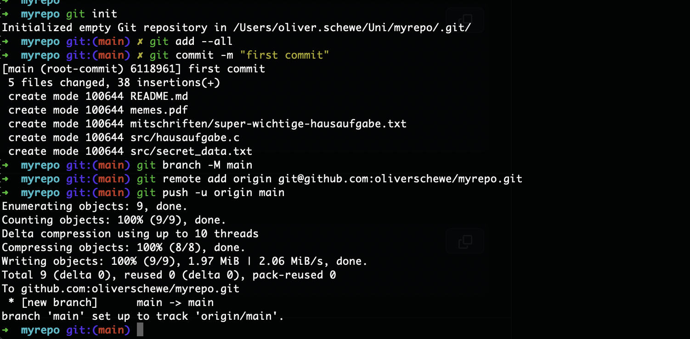

# How-To

## Vorbereitung

Ordner erstellen

```shell
mkdir Uni
cd Uni
```

## Repo clonen
```shell
git clone git@github.com:tyronfranzke/hpi-vorkurs-git.git
```
Ordner `hpi-vorkurs-git` existiert jetzt in Ordner `Uni`.

## neuen Ordner für neues Repo erstellen & Dateien kopieren
Name: `myrepo`
```shell
mkdir myrepo
cp -r hpi-vorkurs-git/* myrepo
```
Alle Dateien von `hpi-vorkurs-git` sind jetzt auch in `myrepo`.

```shell
cd myrepo
```
```shell
ls -l
-------------------
-rw-r--r--  1 oliver.schewe  staff      107  6 Okt 17:45 README.md
-rw-r--r--  1 oliver.schewe  staff  2066082  6 Okt 17:45 memes.pdf
drwxr-xr-x  3 oliver.schewe  staff       96  6 Okt 17:45 mitschriften
drwxr-xr-x  4 oliver.schewe  staff      128  6 Okt 17:45 src
```

## Repo bei Github erstellen
URL: [https://github.com/](https://github.com/)


## Repo mit dem Ordner initialisieren

siehe Github Befehle im leerem Repo auf Github


Git Repo initialisieren
```git
// Git Repo initialisieren
git init

// Alle Dateien hinzufügen
git add --all

// Commit mit allen Dateien erstellen
git commit -m "first commit"

// Branch "main" erstellen (optional, weil eigentlich Standard)
git branch -M main

// Ordner mit dem Git Repo verlinken
git remote add origin git@github.com:oliverschewe/myrepo.git

// Commit ins Repo pushen
git push -u origin main
```


Github-Repo im Browser refreshen und freuen (wenn alle Dateien da sind) ✅


<center></center>